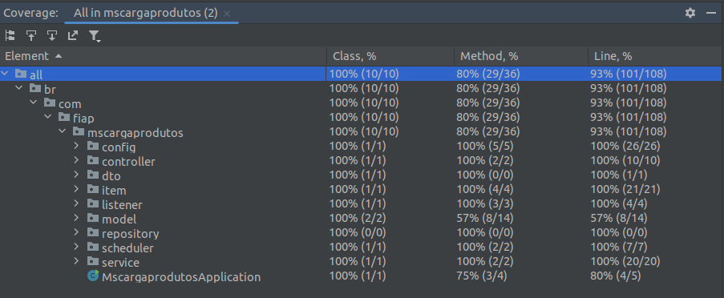

# MsCargaProdutos - Carga de Produtos

## 1. Objetivo

Este serviço tem como funcionalidade principal permitir a importação de dados de produtos em massa através da importação de arquivos agendados ou iniciados manualmente, incluindo as descrições, preços e quantidades em estoque. Após o upload do arquivo, a rotina para processamento iniciará a cada minuto para processar as informações.

## 2. Links

- [GitHub](https://github.com/emoraisdev/gestao-pedidos/tree/master/mscargaprodutos)
- [Swagger](http://<base-url>:8081/swagger-ui/index.html#/)

## 3. Modelagem

*(Seção a ser preenchida com informações detalhadas sobre a modelagem do serviço)*

## 4. Tecnologias

- **Java/Spring Batch Framework**
    - Utilizado como linguagem de programação e framework para processamento batch.
- **MySQL**
    - Banco de dados relacional utilizado para persistência dos dados.
- **Swagger**
    - Framework utilizado para a documentação das APIs.
- **Docker/Docker Hub**
    - Utilizado para a criação de imagens e conteinerização da aplicação.
- **Flyway**
    - Ferramenta para versionamento de migrações e scripts de criação e gerenciamento das tabelas do banco de dados.

## 5. Arquitetura

O sistema segue uma abordagem de camadas, dividindo responsabilidades para facilitar a manutenção e escalabilidade:

- **Camada de Apresentação:** Não aplicável, pois trata-se de um sistema backend.
- **Camada de APIs (Controle):** Contém a implementação do endpoint para o upload do arquivo de produtos.
- **Camada de Operações Agendadas:** Contém a tarefa que processa os produtos salvos na base de dados a cada minuto, de acordo com o horário indicado no campo `horario_execucao`. Se o horário for igual ou menor à data apontada, a linha será atualizada para "S" (nos casos de sucesso).
- **Camada de Lógica de Negócios (Serviços):** Contém a lógica central para a carga dos arquivos, manipulando as linhas do arquivo e inserindo-as na base de dados.
- **Camada de Acesso a Dados (Repositórios):** Responsável pela interação com o banco de dados MySQL, realizando operações de leitura e escrita nas entidades do sistema.
- **Camada de Configuração:** Implementa as configurações do processo batch, como leitura (ItemReader) e escrita (ItemWriter).

A arquitetura do sistema é projetada para ser modular, escalável e eficiente, fornecendo uma solução específica para o processamento de carga dos produtos.

## 6. Qualidade

O desenvolvimento foi realizado utilizando TDD, com a criação de testes unitários. Além disso, foi utilizado o SonarLint para aumentar a qualidade do código, seguindo uma série de padrões de mercado definidos pelo framework.

### 6.1. TDD

A aplicação foi desenvolvida utilizando Test Driven Development, com as seguintes dependências:

- JUnit
- Jupiter API
- AssertJ
- Rest Assured
- Mockito

### 6.2. Cobertura dos testes

Foi alcançada mais de 90% de cobertura de testes em todas as camadas da aplicação.



## 7. Desafios

Os principais desafios deste projeto foram:

- Implementação de uma arquitetura robusta e pensada para microserviços, capaz de lidar com os arquivos de maneira performática e sem causar impactos no fluxo do ecossistema.
- Implementação de testes abrangentes em todas as fases do desenvolvimento, utilizando TDD com JUnit para garantir a qualidade do código e a cobertura de testes necessária.
- Implantação do sistema de versionamento de base de dados com Flyway, garantindo que mudanças na modelagem do serviço não gerem impactos e permitindo rollbacks seguros durante os deploys. Para muitos membros da equipe, essa foi a primeira experiência com esta tecnologia, exigindo uma curva de aprendizado significativa para configurar adequadamente o ambiente.

## 8. Como Testar o Projeto?

1. **Configuração do banco de dados MySQL:**
    1. Atualizar as configurações do arquivo `application.properties` para conectar com o MySQL.
    2. Criar o schema `carga_produto` no banco de dados.
2. **Consultar os contratos de API do microserviço (Swagger):**
    - Acessar: `http://<base-url>:8081/swagger-ui/index.html#/`
3. **Testar as APIs utilizando Postman:**
    1. Todas as APIs desenvolvidas estão mapeadas no arquivo `MicroservicoBatchCargaProduto.postman_collection.json`.
    2. Utilizar a collection disponível no GitHub:
        - Caminho: `src/main/resources/MicroservicoBatchCargaProduto.postman_collection.json`
    3. Para fazer upload do arquivo, ele deverá ser do tipo CSV e seguir o modelo descrito abaixo com a seguinte ordem (Nome Produto, Descrição do produto, valor, quantidade em estoque). Exemplo:
        ```
        Produto A,Descricao do produto A,10.00,3
        Produto B,Descricao do produto B,25.00,200
        ```
        1. O delimitador para cada campo deverá ser sempre a vírgula ",". Caso deseje alterar, isso pode ser feito através do arquivo de propriedades `delimiter.file`.
        2. Um arquivo de exemplo está disponível no caminho: `/src/main/resources/produtos.csv`
4. **Manutenção na base de dados:**
    - Utilizar a pasta de scripts do Flyway:
        - Caminho: `/src/main/resources/db/migration/`

## 9. Conclusão

O microserviço de carga de produtos foi desenvolvido seguindo práticas de desenvolvimento de software com TDD. Isso garantiu um microserviço escalável, atendendo às necessidades de gerenciamento dos produtos. A arquitetura de microserviços facilitou a manutenção e a expansão do serviço sem afetar o ecossistema por completo.
